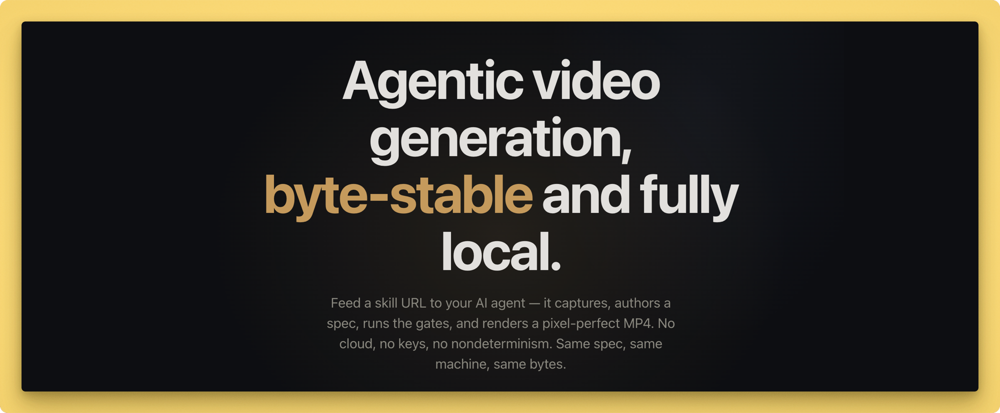

<p align="center">
  <a href="https://lazy-frames.cosmicstack.ai/">
    
  </a>
</p>

# Lazy Frames

[](https://www.npmjs.com/package/lazy-frames)
[](https://github.com/cosmicstack-labs/lazy-frames)

**Agentic video generation.** Feed a skill URL to your AI agent — it captures, authors a spec, runs the gates, and renders a pixel-perfect MP4. Fully local, byte-stable, no cloud, no keys, no nondeterminism.

**Same spec + same machine = byte-identical MP4, every time.**

Part of [CosmicStack.AI](https://cosmicstack.ai).

## Give it to your agent

Paste the raw Markdown skill URL into your AI agent:

```text
https://lazy-frames.cosmicstack.ai/skill.md
```

For example: `Read this skill, then make a promo video for https://example.com.`

---

## Install

### From npm

```bash
npm install lazy-frames
```

Then run any command via `npx`:

```bash
npx lazy doctor
npx lazy capture https://example.com projects/acme
npx lazy render projects/acme
```

### From source (for development or the agentic skill)

```bash
git clone https://github.com/cosmicstack-labs/lazy-frames.git
cd lazy-frames
npm install && npm run build
node packages/cli/dist/index.js doctor
```

## Prerequisites

| Dependency | Required for | Check |
|---|---|---|
| Node.js ≥ 20 | CLI + engine | `node --version` |
| ffmpeg + ffprobe | encoding + audio | `ffmpeg -version` |
| Google Chrome | headless rendering | `lazy doctor` |
| Python 3 | audio sidecar (music, TTS, SFX) | `python3 --version` |
| macOS `say` | TTS narration | `say -v '?'` |

Run `npx lazy doctor` to verify all providers and see your hardware tier.

## Quick start

### Website promo — from URL to MP4

```bash
npx lazy capture https://example.com projects/acme
npx lazy snapshot projects/acme --update
npx lazy check projects/acme
npx lazy preview projects/acme       # review in browser
# ... approve ...
npx lazy render projects/acme         # byte-stable MP4
```

`lazy capture` writes screenshots @2x, palette, copy blocks, fonts, logo, and a starter `spec.json`.

### Cinematic — generated stills + depth parallax + audio

```bash
npx lazy gen image -p projects/cine --seed 21 --style ridge --name r01
npx lazy gen music -p projects/cine --mood calm --bpm 90 --seed 21 --name bgm
# write spec.json referencing assets/gen/r01.png + r01.depth.png
npx lazy render projects/cine
```

## CLI commands

| Command | What it does |
|---|---|
| `lazy doctor` | Environment + provider capability report |
| `lazy capture <url> [project]` | Capture a website → screenshots, palette, copy, starter spec |
| `lazy gen image` | Generate procedural still + matching depth map |
| `lazy gen music` | Generate procedural music WAV |
| `lazy gen tts` | Generate TTS narration WAV (macOS `say`) |
| `lazy check <project>` | Validate spec + run snapshot & determinism gates |
| `lazy snapshot <project> --update` | Establish/refresh the regression baseline |
| `lazy render <project>` | Render to MP4 (byte-stable, with audio) |
| `lazy preview <project>` | Scrubbable timeline preview at localhost:4173 |

## Scene types

| Type | What it does |
|---|---|
| `typography` | Text reveals: titles, quotes, lockups (4 reveal styles) |
| `stat-hit` | Count-up numbers, labels, bars |
| `browser-frame` | Screenshot in a browser chrome mockup with cursor |
| `ui-callout` | Screenshot with dimmed mask, hotspot spotlight, label |
| `atmosphere` | Drifting gradient blobs — ambient backdrops |
| `parallax` | 2.5D camera move over a still (flat or depth-map mode) |
| `video-layer` | Footage playback with trim, speed, grade |
| `three-scene` | Deterministic 3D: cube/ico/grid/particles (canvas 2D) |

Plus: 7 transitions (cut, fade, dissolve, whip-pan, light-leak, dip-to-black, luma-wipe), stage-level CSS grade presets, output-level 3D LUT pipeline, and declarative audio (narration + music + SFX).

## Agentic skill

Lazy Frames ships with a complete agent skill. Point any coding agent at `skill/SKILL.md` — it contains the full routing rules, agent contract, and reference docs. The agent reads the skill (not the source code) and knows how to capture, author, check, preview, and render.

```
skill/
  SKILL.md                    ← entry point + routing + agent contract
  references/
    spec-format.md             ← full spec schema
    scene-types.md             ← all 8 scene types
    workflows.md               ← website-promo / cinematic / edit
    cli.md                     ← every CLI command
    gates.md                   ← determinism + snapshot gates
```

## Determinism

Same spec + same machine = byte-identical MP4 (SHA-256 verified). Enforced by:

- `--jitless` — V8 interpreter only (no JIT nondeterminism)
- `--use-angle=swiftshader` — software rendering (no GPU variance)
- Integer-pixel CSS transforms (no sub-pixel text rendering)
- `putImageData` for canvas scenes (no skia compositing nondeterminism)
- Bitexact ffmpeg encoding (fixed creation_time, `+bitexact`, fixed threads)

## Examples

- `examples/demo` — typography + stat-hit (engine proof)
- `examples/cinematic` — depth-parallax + video-layer + narration + music
- `examples/showreel` — grade + LUT + transitions + SFX + 3D + beats
- `projects/web-demo` — website capture → promo

## Verify

```bash
npm run verify:demo        # byte-stability (two renders, sha256 compare)
npm run verify:cinematic   # gen assets + gates + audio determinism
```

## Architecture

```
spec.json (typed JSON)
  ├─ @lazy/engine       compile spec → HTML composition + channel data
  ├─ @lazy/renderer     headless Chrome (jitless + swiftshader) → frames → ffmpeg → MP4
  ├─ @lazy/capture      site screenshots + palette/copy/font/logo extraction
  ├─ @lazy/gen-sidecar  Python: procedural music, TTS (say), SFX synthesis
  └─ @lazy/cli          lazy capture | gen | check | snapshot | render | preview | doctor
```

## License

MIT © [CosmicStack Labs](https://cosmicstack.ai)
